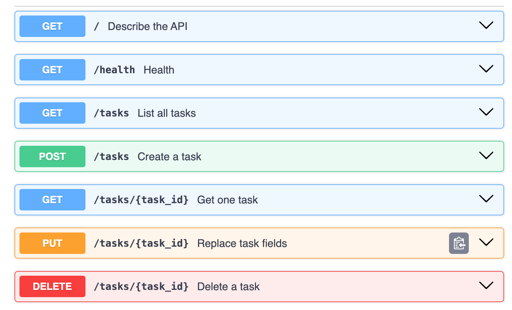
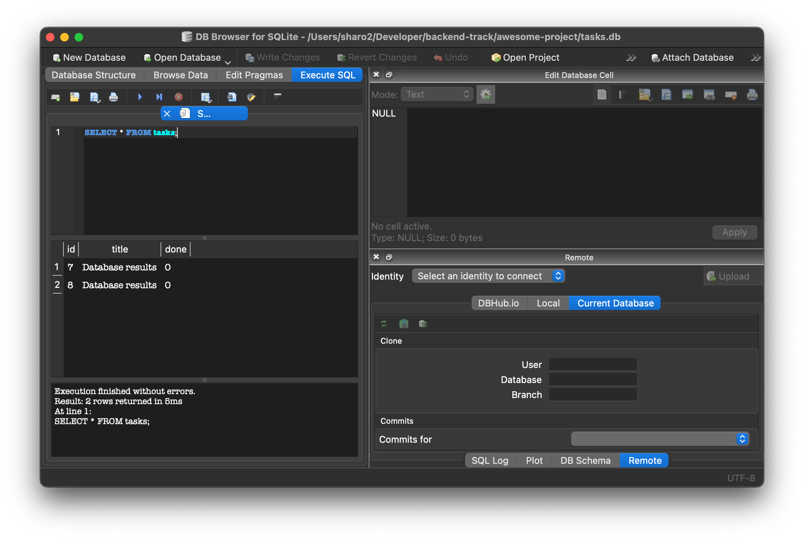

# Task API

A FastAPI application for creating, reading, updating, and deleting tasks.
Tasks are stored in SQLite and survive server restarts.

## Requirements

- Python 3.12 or newer
- uv

## Install and run

From the repository root:

```bash
cd awesome-project
uv sync
uv run fastapi dev main.py
```

Open:

- API: http://localhost:8000
- Swagger UI: http://localhost:8000/docs

The database is created automatically at `awesome-project/tasks.db`.
The application creates the tasks table if missing and inserts three
example tasks whenever the table is empty during startup.

Restarting with existing tasks does not duplicate the examples.
Restarting after deleting every task seeds the examples again.

## Why SQLite?

SQLite stores data in a single file and requires no separate database
server. It keeps tasks available after the application stops or restarts.

The database is ignored by Git so a fresh clone creates its own database.

## Endpoints

| Method | Path | Purpose | Success |
|---|---|---|---|
| GET | `/` | Describe the API | 200 |
| GET | `/health` | Check application health | 200 |
| GET | `/tasks` | List tasks | 200 |
| GET | `/tasks/{task_id}` | Read one task | 200 |
| POST | `/tasks` | Create a task | 201 |
| PUT | `/tasks/{task_id}` | Update title, done, or both | 200 |
| DELETE | `/tasks/{task_id}` | Delete a task | 204 |

List requests support these optional filters:

- `/tasks?done=true`
- `/tasks?search=milk`
- `/tasks?done=false&search=milk`

Create body:

```json
{"title": "Buy milk"}
```

Update body:

```json
{"title": "Buy oat milk", "done": true}
```

Titles must be non-empty strings. Updates must supply at least one
supported field. Explicit null values and unknown fields are rejected.
The done field must be a JSON boolean.

Invalid input returns 400. Unknown task IDs return 404.
Errors use the form `{"error": "Explanation"}`.
Successful deletion returns 204 with an empty body.

## Example HTTP response

Run:

```bash
curl -i http://localhost:8000/health
```

Replace this paragraph with the actual output, including the status line,
headers, and response body.

## SQL exploration

Example query:

```sql
SELECT id, title, done
FROM tasks
WHERE done = 1;
```

This query selects completed tasks. SQLite stores done as 0 or 1;
the API returns false or true.

Replace this paragraph with what the query returned in your database
and how a saved manual SQL change appeared through the API.

## Persistence check

Replace this paragraph with your observed result after creating a task,
recording its ID, restarting the server, and retrieving that same ID.

## Screenshots




